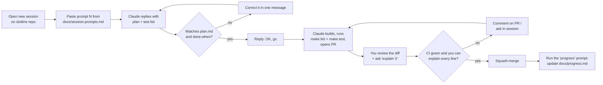

# Start here: building Slotline with Claude cloud sessions

This is the one-time setup and the loop you repeat for each of the 12 sessions.
Read it top to bottom once; after that you only need **section 4** and `docs/session-prompts.md`.

| File | What it's for | When you read it |
| --- | --- | --- |
| `docs/START-HERE.md` | Setup + the working loop (this file) | Once, then section 4 each session |
| `docs/plan.md` | The full spec (export of your Slotline Build Plan doc) | When Claude's plan looks off, check it here |
| `docs/architecture.md` | How everything flows, with diagrams | Before sessions 1, 6, 8 and before interviews |
| `docs/session-prompts.md` | Copy-paste prompt for every session | Start of every session |
| `docs/progress.md` | Log of what each session built and what you learned | End of every session |
| `CLAUDE.md` | Rules Claude reads automatically every session | Claude reads it; you edit it when a rule is missing |

---

## 1. Create the repository (15 min)

1. On GitHub create a **new empty repo** named `slotline` (private is fine; make it public before you share it in your portfolio).
2. Copy every file from this starter kit into the repo root, keeping the folders:

   ```text
   slotline/
   ├── CLAUDE.md
   ├── README.md
   ├── .claude/settings.json
   ├── .github/pull_request_template.md
   ├── scripts/session-start.sh
   └── docs/
       ├── START-HERE.md
       ├── plan.md              ← you add this (step 3)
       ├── architecture.md
       ├── session-prompts.md
       ├── progress.md
       └── adr/0000-template.md
   ```

3. **Add `docs/plan.md`**: open your *Slotline Build Plan* doc on claude.ai → download/export as **Markdown** → save it as `docs/plan.md`.
   The three diagrams in the doc export as `[embedded content]` placeholders; that's fine, the same diagrams are in `docs/architecture.md` as Mermaid.
4. Make the hook script executable and push:

   ```bash
   chmod +x scripts/session-start.sh
   git add . && git commit -m "docs: project plan, architecture and Claude setup" && git push
   ```

## 2. Connect Claude to GitHub (10 min)

1. Go to **claude.ai/code** and connect your GitHub account.
2. Install the **Claude GitHub App** and give it access to the `slotline` repo only.
3. Select `slotline` as the repository for new sessions.

## 3. Configure the cloud environment (15 min)

In claude.ai/code, create (or edit) the environment you'll use for Slotline:

| Setting | Value | Why |
| --- | --- | --- |
| Network access | **Trusted** | Reaches PyPI, GitHub and Docker Hub so `uv sync` and `docker pull` work |
| Setup script | see below | Pre-pulls images once; cached for later sessions |
| Environment variables | none needed yet | Real secrets go to GitHub Environments and the host in session 12, never here |

**Setup script** (paste into the environment's setup script box):

```bash
#!/usr/bin/env bash
docker pull postgres:17 || true
docker pull redis:7 || true
docker pull axllent/mailpit || true
```

The repo's `.claude/settings.json` adds a **SessionStart hook** that runs `scripts/session-start.sh` every time a session starts.
It runs `uv sync` once `pyproject.toml` exists and starts Postgres, Redis and Mailpit once `compose.yaml` exists, so in session 1 it does nothing, and from session 2 on the stack is already up when Claude starts.

> If a session reports that Docker isn't running or images can't be pulled, tell Claude:
> "Docker isn't available here; start the pre-installed PostgreSQL 17 and Redis instead, create the slotline database, and point DATABASE_URL at it for this session only." Don't let it change the code to work around it.

## 4. The loop for every session (2 per week)



What you do in each step:

1. **New session** on claude.ai/code with the `slotline` repo selected. One session = one PR. Don't reuse a session for the next PR.
2. **Paste the prompt** for that session from `docs/session-prompts.md`.
3. **Check the plan** Claude writes before any code. Compare it with the session's *Done when* line and the plan section. This is where you learn the most; spend 10 minutes here.
4. Reply `OK, go` (or corrections).
5. **Review the PR** on GitHub. For anything you can't explain, ask in the session: `Explain <file>:<lines> like I'll be asked about it in an interview.`
6. Turn on **Auto-fix** for the PR so Claude reacts to failing CI and your review comments.
7. **Merge only when** CI is green and you can explain every line (your Brahmastra rule).
8. **Close the loop** with the progress prompt (bottom of `session-prompts.md`). It updates `docs/progress.md` with what was built, decisions, and what to remember.

## 5. GitHub settings to do by hand

These can't be done from a session; do them right after session 2 merges:

- **Branch protection on `main`**: Settings → Branches → add rule → require a pull request, require status checks (select all seven CI jobs once they've run once), block force pushes.
- **Dependabot**: comes from `.github/dependabot.yml` (session 2); enable Dependabot alerts in Settings → Security.
- **Environments** (session 12): create `staging` and `production`; on `production`, add yourself as required reviewer. Put host tokens and secrets there.

## 6. Rules of thumb

- **Small asks beat big asks.** If a session is going long, ask Claude to open the PR with what's done and finish the rest in the next session.
- **The plan is the source of truth.** If you change a decision, update `docs/plan.md` (or add an ADR) in the same PR, so later sessions don't build on the old version.
- **Add to CLAUDE.md when Claude repeats a mistake.** One line per rule.
- **Never paste secrets into a session.** Use `.env` locally (git-ignored) and GitHub Environments for deploys.
- If a week slips: cut session 11 polish, never tests.

## 7. Schedule (about 6 weeks at 2 sessions a week)

| Week | Sessions | Milestone |
| --- | --- | --- |
| 1 | 1 Skeleton · 2 CI | Repo runs locally, CI blocks bad PRs |
| 2 | 3 Auth · 4 Catalogue | Tenants, staff, providers, services |
| 3 | 5 Availability · 6 Bookings core | **200-concurrent test passes** |
| 4 | 7 Lifecycle · 8 Worker | Reschedule/cancel, jobs run exactly once |
| 5 | 9 Notifications · 10 Waitlist + webhooks | Real automation |
| 6 | 11 Observability · 12 Ship it | Live URL, README results, build-in-public post |
