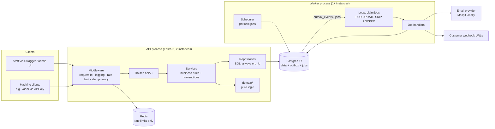
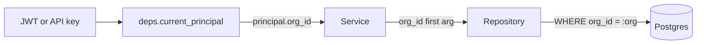
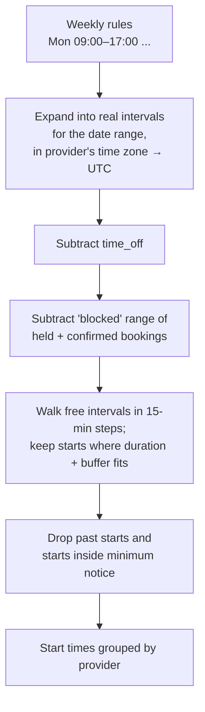
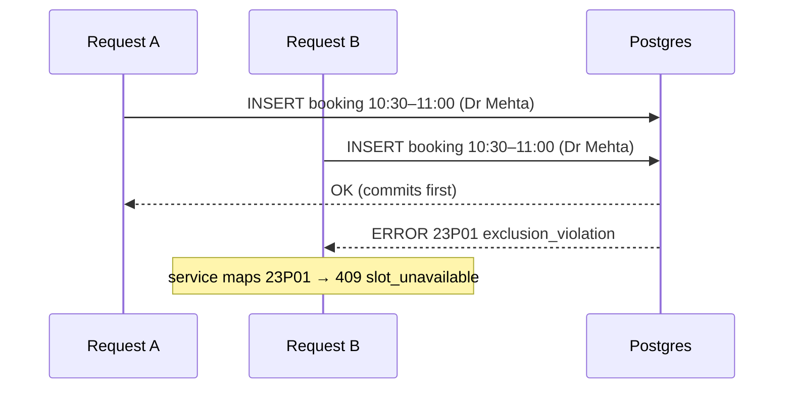
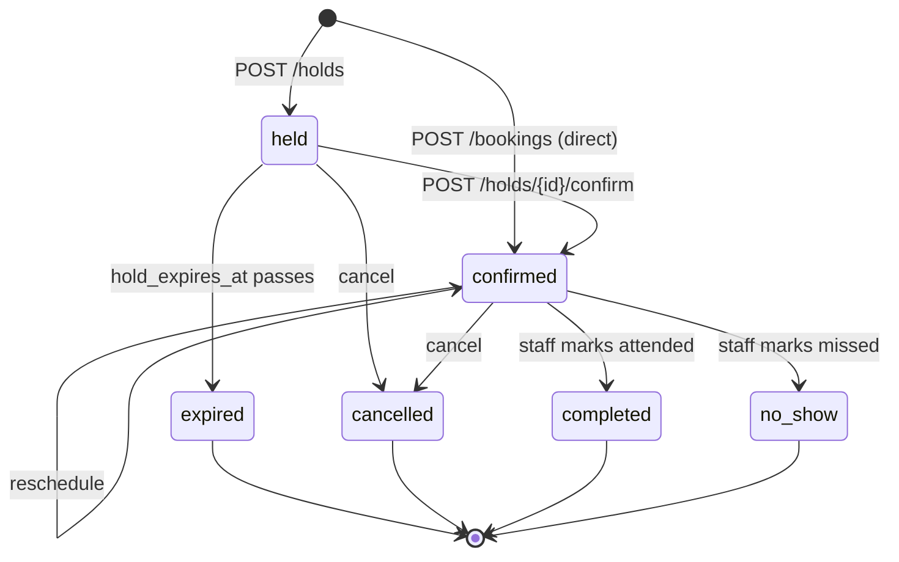
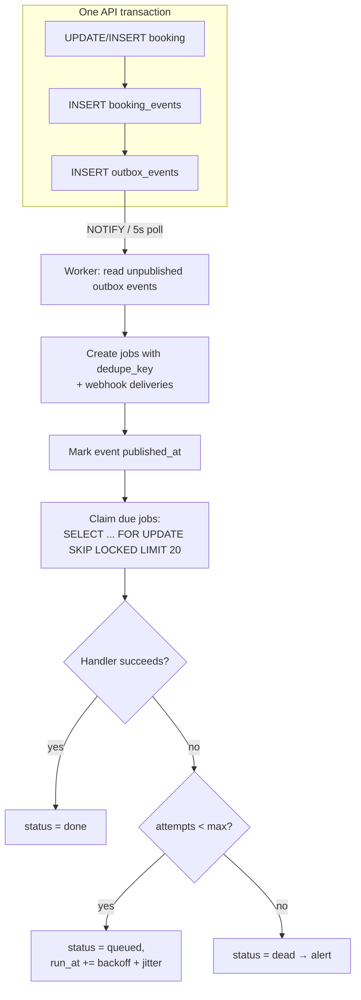
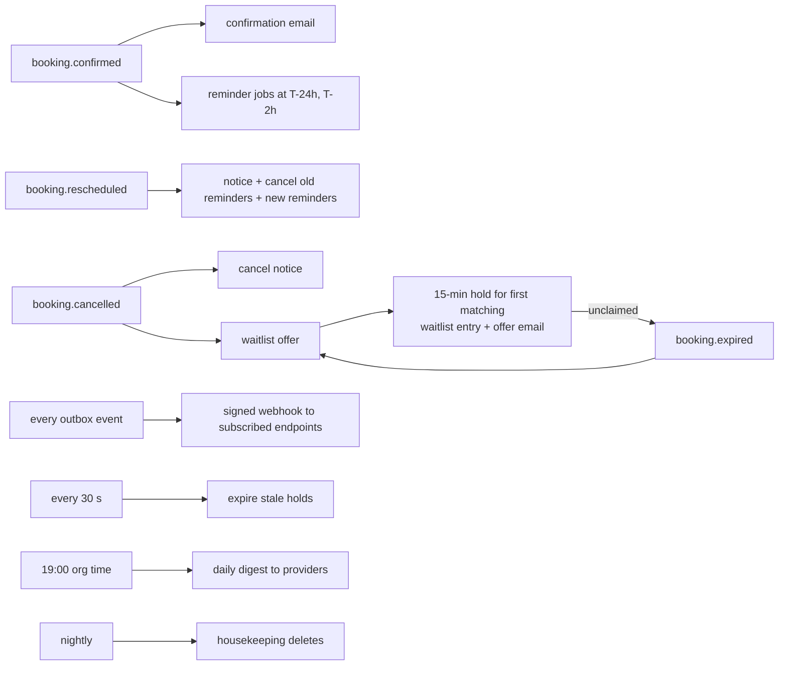
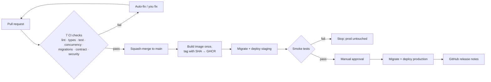

# Slotline architecture: how everything flows

Read this when you want to understand *why* the code is shaped the way it is.
Diagrams are Mermaid; GitHub renders them automatically. Section numbers match the
sessions that build each part.

---

## 1. The big picture

Two processes, one codebase, one database. Postgres is both the store and the job queue.



**The one-sentence version:** the API changes data and writes "something needs to happen"
rows in the *same transaction*; the worker picks those rows up and does the slow, retryable
work (email, webhooks, expiry).

Why two processes? A request should finish in milliseconds. Sending email or calling a
customer's webhook can take seconds or fail. Keeping that out of the request makes the API
fast and makes retries safe.

---

## 2. Inside one request (sessions 1, 3, 7)

```mermaid
sequenceDiagram
  autonumber
  participant C as Client
  participant MW as Middleware
  participant RT as Route
  participant SV as Service
  participant RP as Repository
  participant PG as Postgres

  C->>MW: POST /api/v1/holds<br/>X-API-Key, Idempotency-Key
  MW->>MW: assign X-Request-ID, start log context
  MW->>MW: rate limit check (Redis)
  MW->>PG: insert idempotency key (ON CONFLICT DO NOTHING)
  alt key seen before with same body
    MW-->>C: replay stored response
  end
  MW->>RT: request
  RT->>RT: auth → principal(org_id, scopes); validate body (Pydantic)
  RT->>SV: create_hold(principal, data)
  SV->>PG: BEGIN
  SV->>RP: expire stale holds in range
  SV->>RP: insert booking (status=held)
  SV->>RP: insert booking_event + outbox_event
  SV->>PG: COMMIT
  SV-->>RT: booking
  RT-->>MW: 201 + body
  MW->>PG: store response under idempotency key
  MW-->>C: 201 Created
```

What each layer is allowed to do:

| Layer | Folder | Does | Never does |
| --- | --- | --- | --- |
| Middleware | `middleware/` | request ID, logs, rate limit, idempotency | business rules |
| Route | `api/v1/` | parse HTTP, auth, call one service, map to response | SQL, commit |
| Service | `services/` | rules, transactions, call domain + repos | know about HTTP |
| Domain | `domain/` | pure maths: slots, state machine, time zones | any I/O |
| Repository | `repositories/` | SQL, always filtered by `org_id` | business decisions |

---

## 3. Multi-tenancy (session 3)

Every business table has `org_id`. The org comes from the credential:



- A request can never *name* a tenant; URLs carry only resource IDs.
- If org A asks for org B's booking ID, the query finds nothing → **404** (not 403, which
  would confirm the ID exists).
- A test calls every endpoint as org A with org B's IDs and expects 404 everywhere.

Auth types: staff log in (15-minute access JWT + rotating 30-day refresh token); machines use
hashed API keys (`sl_live_…`, shown once). Reusing an old refresh token revokes the whole
token family (someone stole it).

---

## 4. Availability: computed, never stored (session 5)

There is no "slots" table. Open start times are calculated on demand:



Availability is a **hint**. Two people can see the same free slot; only the hold/booking
call decides who gets it (section 5).

Time zones: store UTC everywhere; use the provider's IANA zone only to expand working hours
and for display. A DST test week (Europe/Dublin) proves 09:00 stays 09:00 local.

---

## 5. The double-booking guarantee (session 6) — the heart of the project

```sql
CONSTRAINT bookings_no_overlap EXCLUDE USING gist (
  provider_id WITH =,
  blocked     WITH &&
) WHERE (status IN ('held', 'confirmed'))
```

Read it as: *"for active bookings, no two rows may have the same provider AND overlapping
`blocked` ranges."* Postgres enforces this atomically, even with 200 requests at once.



Why not "SELECT to check, then INSERT"? Both requests can run the SELECT before either
inserts, both see the slot free, both insert. That race is exactly what the constraint
removes.

The five rules that make it work:

1. **Half-open ranges** `[start, end)` so 10:00–10:30 and 10:30–11:00 don't overlap.
2. **`blocked` = `during` + buffer**: a 30-min service with 10-min clean-up blocks 40.
3. **Expire stale holds in the same transaction** before inserting, so a hold that
   expired one second ago doesn't block anyone while waiting for the worker.
4. **Translate `23P01` → 409**, never a 500.
5. **Reschedule = one UPDATE** of `during` + `blocked`; if it conflicts, the original stays.

---

## 6. Booking lifecycle (sessions 6, 7)



- Only `held` and `confirmed` are **active** (count in the constraint).
- The allowed transitions are a table in `domain/booking_state.py`; anything else →
  `409 invalid_transition`.
- Every transition appends a `booking_events` row (audit trail) and an `outbox_events` row.
- Confirming after expiry → `410 hold_expired`.

Safety for retries and edits:

| Problem | Mechanism | Result |
| --- | --- | --- |
| Client retries a POST after a timeout | `Idempotency-Key` header, stored 24 h | Same response replayed, no duplicate booking |
| Same key, different body | request hash compare | `422 idempotency_key_reused` |
| Two staff edit one booking | `If-Match: <version>` | Second gets `412 precondition_failed` |

---

## 7. The worker: outbox + jobs (session 8)



Key ideas, in plain words:

- **Transactional outbox:** the "send a confirmation" row commits *with* the booking. If the
  transaction rolls back, the row never existed, so no email for a booking that doesn't exist.
  If the worker crashes, the row is still there, so the email is delayed, never lost.
- **SKIP LOCKED:** many workers can poll the same table; each row is locked by whoever grabs
  it first and skipped by the others. A crashed worker's lock times out (`locked_until`).
- **Exactly-once effect:** jobs can run more than once (retries), so every handler re-reads
  the booking and does nothing if it changed, and `dedupe_key` has a unique index.
- **Graceful shutdown:** on SIGTERM, stop claiming, finish in-flight jobs (≤ 25 s), exit.

---

## 8. Automations (sessions 8–10)



Webhooks are signed: `HMAC-SHA256(secret, timestamp + "." + body)` in the
`Slotline-Signature` header. Receivers verify the signature, reject timestamps older than
5 minutes, and dedupe on event ID. Retries: 1 m, 5 m, 30 m, 2 h, 12 h, then dead.
Webhook URLs must be HTTPS and must not resolve to private IPs (SSRF guard).

---

## 9. Delivery pipeline (sessions 2, 12)



Same image in staging and production, so what passed staging is byte-for-byte what ships.
Rollback = redeploy the previous SHA, which is why migrations must be backwards-compatible.

---

## 10. Observability (session 11)

One booking can be followed end to end: the API writes the trace ID onto the outbox event,
the worker continues that trace, so a single trace shows *request → DB insert → job → email*.

| Signal | Tool | Answers |
| --- | --- | --- |
| Logs | structlog JSON with `request_id`, `org_id`, `job_id` | What happened to this request? |
| Traces | OpenTelemetry | Where was the time spent? |
| Metrics | Prometheus | Is it healthy right now? (5xx rate, p95, queue age, dead jobs) |
| Errors | Sentry | What crashed, in which release? |

---

## 11. Glossary

| Term | Meaning |
| --- | --- |
| Tenant / org | One clinic or salon; all its data carries its `org_id` |
| Provider | A person or room that can be booked |
| Hold | A temporary booking (default 5 min) while a customer confirms |
| `during` / `blocked` | What the customer sees / what's unavailable incl. buffer |
| Exclusion constraint | Postgres rule that no two rows may "conflict" on given operators |
| `tstzrange` | Postgres type for a time range with time zone |
| Outbox | Table of events written in the same transaction as the data change |
| SKIP LOCKED | Postgres option: skip rows another transaction has locked |
| Idempotency key | Client-chosen ID that makes retrying a request safe |
| Problem Details | Standard JSON error shape (RFC 9457) |
| ADR | Architecture Decision Record: one page on a choice and its trade-off |

## 12. Questions to be able to answer (interview prep)

1. Why an exclusion constraint instead of `SELECT … FOR UPDATE` or an application lock?
2. What happens if the worker crashes halfway through sending a reminder?
3. How do you guarantee a reminder is never sent for a cancelled booking?
4. Why 404 instead of 403 for another tenant's ID?
5. Why Postgres as a queue instead of Redis/RabbitMQ, and when would you switch?
6. How does a client safely retry a timed-out booking request?
7. How do you deploy a column rename without downtime?
8. Walk through the 200-concurrent-request test and what it proves.
