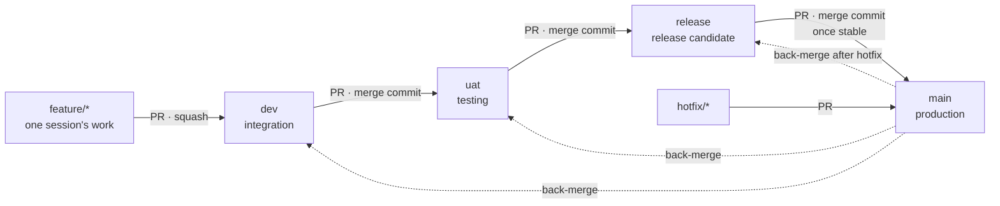

# Branching and release flow

Every change moves through five levels. Nothing skips a level, and nothing is pushed
directly to `dev`, `uat`, `release` or `main`: every move is a pull request.



## What each branch means

| Branch | Holds | Created from | Merges into | What happens on merge | Environment |
| --- | --- | --- | --- | --- | --- |
| `feature/sNN-name` | One session's work (one PR) | `dev` | `dev` | 7 CI checks must pass | none |
| `fix/name`, `docs/name`, `chore/name` | Small non-session changes | `dev` | `dev` | 7 CI checks must pass | none |
| `dev` | Integrated work, may be unfinished | — | `uat` | CI runs on the merged result | none (saves cost) |
| `uat` | What you're testing by hand | — | `release` | Deploy to **UAT** + smoke tests | UAT (from session 12) |
| `release` | Frozen release candidate | — | `main` | Full suite + load test, version and changelog checked | none |
| `main` | Exactly what runs in production | — | — | Manual approval → deploy **production** → GitHub release + tag `vX.Y.Z` | Production (from session 12) |
| `hotfix/name` | Urgent production fix | `main` | `main` | Same as `main`, then back-merge | — |

Until session 12 sets up hosting, `uat` and `main` only run CI; the deploy steps are added then.

## The two merge rules that keep branches in sync

1. **feature → dev: squash.** One clean commit per session on `dev`.
2. **dev → uat → release → main: merge commit, never squash, never rebase.** Squashing a
   promotion creates a new commit that `dev` doesn't have, so the branches drift apart and the
   next promotion shows old changes again as "new". A merge commit keeps the same history on
   every level.

## Everyday flow (one session)

```bash
git switch dev && git pull                     # always start from fresh dev
git switch -c feature/s03-auth                 # Claude does this in cloud sessions
# ... work, commit, push ...
gh pr create --base dev --fill                 # PR into dev
```

Review the PR, wait for CI, then **Squash and merge** on GitHub. Delete the feature branch
(GitHub offers a button; Claude's cloud proxy can't delete branches, so do it on GitHub).

## Promotion flow (when a set of sessions is ready to test)

Typical rhythm: promote to `uat` after every 1–2 sessions, to `release` and `main` at the
milestones in the table below.

```bash
# 1. dev → uat: start testing
gh pr create --base uat --head dev --title "promote: dev → uat (sessions 3–4)" --body "What to test: ..."
#    Merge with "Create a merge commit". Test on UAT (or locally from the uat branch until session 12).

# 2. uat → release: freeze a candidate
gh pr create --base release --head uat --title "release: v0.3.0 candidate"
#    Merge commit. Release checks run (full suite, load test). Bump version + CHANGELOG on a
#    chore/release-v0.3.0 branch from release if needed (PR into release).

# 3. release → main: ship once stable
gh pr create --base main --head release --title "release: v0.3.0"
#    Merge commit. Approve the production deployment. The workflow tags v0.3.0.
```

**"Stable" means:** UAT tested against the session's *Done when* line, CI and release checks
green, no open bugs labelled `blocker`. After session 12, also 24 hours on UAT with no alerts.

## Hotfix flow

```bash
git switch main && git pull
git switch -c hotfix/hold-expiry-timezone
# fix + test
gh pr create --base main --fill          # merge commit; deploys to production after approval
# then bring the fix back down so it isn't lost on the next promotion:
gh pr create --base release --head main --title "back-merge: hotfix into release"
gh pr create --base uat     --head main --title "back-merge: hotfix into uat"
gh pr create --base dev     --head main --title "back-merge: hotfix into dev"
```

## Versioning

Semantic versioning `MAJOR.MINOR.PATCH`, starting at `v0.1.0`.
- Each release from `release` → `main` bumps MINOR (`v0.3.0` → `v0.4.0`).
- Each hotfix bumps PATCH (`v0.4.0` → `v0.4.1`).
- `v1.0.0` = session 12 done and the Definition of Done in `docs/plan.md` is met.

Tags are created by the deploy workflow on `main` (cloud sessions can't push tags).

## Suggested milestones

| Release | After sessions | What's in it |
| --- | --- | --- |
| v0.1.0 | 1–2 | Skeleton + CI (proves the whole flow works) |
| v0.2.0 | 3–5 | Auth, catalogue, availability |
| v0.3.0 | 6–7 | Bookings with the concurrency guarantee |
| v0.4.0 | 8–10 | Worker, notifications, waitlist, webhooks |
| v1.0.0 | 11–12 | Observability, deploy pipeline, docs |

## GitHub settings to click (once, by hand)

**1. Default branch → `dev`** (Settings → General → Default branch). New sessions and clones
then start from `dev`.

**2. Rules for `dev`, `uat`, `release`, `main`** (Settings → Rules → Rulesets → New branch
ruleset, target those four branches):
- Restrict deletions; block force pushes
- Require a pull request before merging (0 approvals is fine solo)
- Require status checks: `branch-flow` now; add the 7 CI jobs after session 2 has run once
- Allowed merge methods: **squash** for `dev`; **merge** for `uat`, `release`, `main`
  (create two rulesets if you want different merge methods)

**3. Merge buttons** (Settings → General → Pull Requests): enable both "Allow merge commits"
and "Allow squash merging"; disable "Allow rebase merging". Turn on "Automatically delete head
branches".

**4. Environments (session 12):** `uat` (no approval) and `production` (you as required
reviewer, deployment branch: `main` only).

## Enforcement

`.github/workflows/branch-flow.yml` fails any PR that skips a level, for example `feature/*`
straight into `uat`, or `dev` straight into `main`. Make it a required check (step 2 above).
