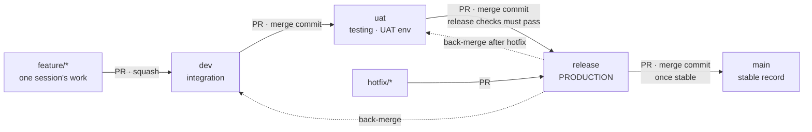

# Branching and release flow

Every change moves through five levels. Nothing skips a level, and nothing is pushed
directly to `dev`, `uat`, `release` or `main`: every move is a pull request.

**`release` is production.** Merging into `release` deploys to production (after one approval).
**`main` is the stable record**: it's updated only after a release has run cleanly in
production, so `main` always holds the last known-good production code.



## What each branch means

| Branch | Holds | Created from | Merges into | What happens on merge | Environment |
| --- | --- | --- | --- | --- | --- |
| `feature/sNN-name` | One session's work (one PR) | `dev` | `dev` | 7 CI checks must pass | none |
| `fix/`, `docs/`, `chore/` | Small non-session changes, version bumps | `dev` | `dev` | 7 CI checks must pass | none |
| `dev` | Integrated work | — | `uat` | CI on the merged result | none (saves cost) |
| `uat` | What you're testing by hand | — | `release` | Deploy to **UAT** + smoke tests | UAT (from session 12) |
| `release` | **What runs in production** | — | `main` | Approval → deploy **production** → smoke → GitHub release + tag `vX.Y.Z` | Production (from session 12) |
| `main` | Last release that proved stable in production | — | — | CI only; no deploy | none |
| `hotfix/name` | Urgent production fix | `release` | `release` | Same as `release`, then back-merge | — |

Until session 12 sets up hosting, `uat` and `release` only run CI; the deploy steps are added then.

## The release gate

Because merging into `release` ships to production, the checks run **on the PR from `uat`
into `release`, before you can merge**:

- the seven CI checks and `branch-flow`
- `release-check`: full test suite, load test (p95 in the job summary), and the version in
  `pyproject.toml` has a matching `CHANGELOG.md` entry with no existing tag
- the PR is from `uat`, and that `uat` commit has deployed to UAT and passed smoke tests

Merge only after you've tested the change on UAT.

## The two merge rules that keep branches in sync

1. **feature → dev: squash.** One clean commit per session on `dev`.
2. **dev → uat → release → main: merge commit, never squash, never rebase.** Squashing a
   promotion creates a new commit that `dev` doesn't have, so the branches drift apart and the
   next promotion shows old changes again as "new". A merge commit keeps the same history on
   every level.

## Everyday flow (one session)

```bash
git switch dev && git pull                     # always start from fresh dev
git switch -c feature/s03-auth                 # Claude does this in cloud sessions
# ... work, commit, push ...
gh pr create --base dev --fill                 # PR into dev
```

Review the PR, wait for CI, then **Squash and merge**. Delete the feature branch on GitHub
(cloud sessions can't delete branches).

## Promotion flow

```bash
# 0. Bump the version on dev (any chore/ branch → dev, squash):
#    pyproject.toml version + CHANGELOG.md entry for vX.Y.Z

# 1. dev → uat: deploys UAT; test there
gh pr create --base uat --head dev --title "promote: dev → uat (v0.3.0)" --body "What to test: ..."
#    Merge with "Create a merge commit".

# 2. uat → release: ship to production
gh pr create --base release --head uat --title "release: v0.3.0"
#    Wait for release-check to pass, merge (merge commit), approve the production deployment.
#    The workflow tags v0.3.0 and creates the GitHub release.

# 3. release → main: record it as stable
gh pr create --base main --head release --title "stable: v0.3.0"
#    Merge commit, once v0.3.0 has been stable in production.
```

**"Stable" means:** v0.x running in production for at least 24 hours with no alerts, no
rollback, and no open bugs labelled `blocker`. Before session 12 (no hosting yet): CI and
release checks green and the session's *Done when* verified locally.

## Hotfix flow

```bash
git switch release && git pull
git switch -c hotfix/hold-expiry-timezone
# failing test + fix + PATCH version bump and CHANGELOG entry (v0.4.0 → v0.4.1)
gh pr create --base release --fill       # merge commit; deploys to production after approval
# then bring the fix back down so the next promotion doesn't undo it:
gh pr create --base uat  --head release --title "back-merge: v0.4.1 into uat"
gh pr create --base dev  --head release --title "back-merge: v0.4.1 into dev"
# and once stable:
gh pr create --base main --head release --title "stable: v0.4.1"
```

## Rollback

Production runs whatever `release` points to, deployed as an image tagged with the commit SHA.
To roll back, re-run the production deploy for the previous release's SHA (GitHub Actions →
deploy-prod → Run workflow with the old SHA), then fix forward with a hotfix. `main` tells you
the last version known to be good.

## Versioning

Semantic versioning `MAJOR.MINOR.PATCH`, starting at `v0.1.0`.
- Each promotion to `release` bumps MINOR (`v0.3.0` → `v0.4.0`), done on `dev` first.
- Each hotfix bumps PATCH (`v0.4.0` → `v0.4.1`), done on the hotfix branch.
- `v1.0.0` = session 12 done and the Definition of Done in `docs/plan.md` is met.

Tags are created by the production deploy workflow (cloud sessions can't push tags).

## Suggested milestones

| Release | After sessions | What's in it |
| --- | --- | --- |
| v0.1.0 | 1–2 | Skeleton + CI (proves the whole flow works) |
| v0.2.0 | 3–5 | Auth, catalogue, availability |
| v0.3.0 | 6–7 | Bookings with the concurrency guarantee |
| v0.4.0 | 8–10 | Worker, notifications, waitlist, webhooks |
| v1.0.0 | 11–12 | Observability, deploy pipeline, docs |

## GitHub settings to click (once, by hand)

**1. Default branch → `dev`** (Settings → General → Default branch). New sessions and clones
then start from `dev`.

**2. Rules for `dev`, `uat`, `release`, `main`** (Settings → Rules → Rulesets → New branch
ruleset, target those four branches):
- Restrict deletions; block force pushes
- Require a pull request before merging (0 approvals is fine solo)
- Require status checks (a check only appears in the picker after it has run once, so merge
  or open the session 2 PR first). Add all of these, exactly as spelled:
  `branch-flow`, `lint`, `types`, `test`, `concurrency`, `migrations`, `contract`, `security`
  (the seven jobs of `.github/workflows/ci.yml`). Add `release-check` on `release` after
  session 12.
- Allowed merge methods: **squash** for `dev`; **merge** for `uat`, `release`, `main`
  (two rulesets if you want different merge methods)

**3. Merge buttons** (Settings → General → Pull Requests): enable "Allow merge commits" and
"Allow squash merging"; disable "Allow rebase merging". Turn on "Automatically delete head
branches".

**4. Environments (session 12):** `uat` (deployment branch: `uat`, no approval) and
`production` (deployment branch: `release` only, you as required reviewer).

## Enforcement

`.github/workflows/branch-flow.yml` fails any PR that skips a level, for example `feature/*`
straight into `uat`, `dev` straight into `release`, or anything other than `release` into
`main`. Make it a required check (step 2 above).
