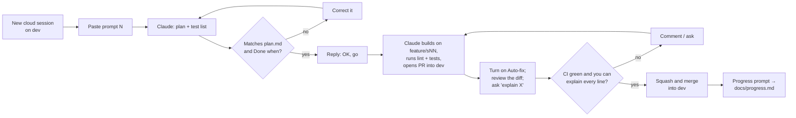

# Start here

The order to read things, the one-time setup, and the loop you repeat for each of the 12
sessions. After the first week you only need section 4 and `docs/session-prompts.md`.

## 1. What to read, in this order

| # | File | Why | Time |
| --- | --- | --- | --- |
| 1 | `docs/PROJECT-OVERVIEW.md` | What Slotline is, who uses it, features, known gaps | 15 min |
| 2 | `docs/architecture.md` | How the API, worker and Postgres flow, with diagrams | 30 min |
| 3 | `docs/BRANCHING.md` | feature → dev → uat → release (production) → main | 10 min |
| 4 | `docs/LOCAL-SETUP.md` | Get it onto your Mac | 20 min (doing) |
| 5 | This file, sections 2–4 | Cloud setup and the working loop | 20 min (doing) |
| 6 | `docs/session-prompts.md` | The prompt for each session | per session |
| — | `docs/plan.md` | The full spec. Skim once; look things up when a plan looks wrong | reference |
| — | `docs/progress.md` | What's done; updated after every merge | per session |
| — | `CLAUDE.md` | Rules Claude follows automatically. Edit it when Claude repeats a mistake | reference |

## 2. One-time GitHub setup (15 min, by hand)

The branches `dev`, `uat` and `release` already exist. On github.com/kartik8904/slotline:

1. **Settings → General → Default branch:** switch to `dev`.
2. **Settings → General → Pull Requests:** allow merge commits and squash merging; disable
   rebase merging; turn on "Automatically delete head branches".
3. **Settings → Rules → Rulesets:** add the rules in `docs/BRANCHING.md` ("GitHub settings to
   click") for `dev`, `uat`, `release`, `main`. Require the `branch-flow` check now; add the
   seven CI checks after session 2.
4. Install the **Claude GitHub App** on this repo only: <https://github.com/apps/claude>.
   It's needed for cloud sessions on a private repo and for Auto-fix.

## 3. Cloud environment on claude.ai/code (10 min)

1. Go to **claude.ai/code**, connect GitHub, and select `kartik8904/slotline`.
2. Create or edit the environment you'll use for Slotline:

| Setting | Value | Why |
| --- | --- | --- |
| Network access | **Trusted** | Reaches PyPI, GitHub and Docker Hub |
| Setup script | below | Pre-pulls images once; the environment cache keeps them |
| Environment variables | none yet | Real secrets go to GitHub Environments in session 12, never here |

```bash
#!/usr/bin/env bash
docker pull postgres:17 || true
docker pull redis:7 || true
docker pull axllent/mailpit || true
```

The repo's `.claude/settings.json` runs `scripts/session-start.sh` at the start of every
cloud session: `uv sync` once `pyproject.toml` exists, and `docker compose up -d postgres
redis mailpit` once `compose.yaml` exists. In session 1 it does nothing; from session 2 on,
the stack is already running when Claude starts. On your laptop it does nothing at all.

## 4. The loop for every session (about 2 a week)



1. **New session** on claude.ai/code, repo `slotline`, branch **`dev`**. One session = one PR.
2. **Paste the prompt** from `docs/session-prompts.md`.
3. **Check the plan** before any code: compare it with that session's *Done when* line and
   the plan section. This is where you learn the most; spend 10 minutes here.
4. Reply `OK, go`, or correct it.
5. Claude opens a PR from `feature/sNN-name` into **`dev`**. Open the CI status bar and turn
   on **Auto-fix** so Claude reacts to failing checks and your review comments.
6. **Review** on GitHub. For anything unclear, ask in the session:
   `Explain <file>:<lines> like I'll be asked about it in an interview.`
   To run it yourself: `git fetch && git switch feature/sNN-name && make test` (see LOCAL-SETUP).
7. **Squash and merge** into `dev` only when CI is green and you can explain every line.
8. Run the **progress prompt** so `docs/progress.md` records what was built and learned.

**Promote** at the milestones in `docs/BRANCHING.md` (v0.1.0 after sessions 1–2, and so on)
using the promotion prompts at the bottom of `docs/session-prompts.md`.

## 5. Rules of thumb

- **Small asks beat big asks.** If a session runs long, ask Claude to open the PR with what's
  done and continue in a new session.
- **The plan is the source of truth.** If you change a decision, update `docs/plan.md` or add
  an ADR in the same PR.
- **Add a line to CLAUDE.md** whenever Claude repeats a mistake.
- **Never paste secrets into a session.** Use `.env` locally (git-ignored) and GitHub
  Environments for deploys.
- **Decide the known gaps** in `docs/PROJECT-OVERVIEW.md` section 14 before the session listed.
- If a week slips: cut session 11 polish, never tests.

## 6. Schedule (about 6 weeks)

| Week | Sessions | Release |
| --- | --- | --- |
| 1 | 0 Check · 1 Skeleton · 2 CI | v0.1.0 (proves the whole branch flow) |
| 2 | 3 Auth · 4 Catalogue | |
| 3 | 5 Availability · 6 Bookings core | v0.2.0 after 5, v0.3.0 after 6–7 |
| 4 | 7 Lifecycle · 8 Worker | |
| 5 | 9 Notifications · 10 Waitlist + webhooks | v0.4.0 |
| 6 | 11 Observability · 12 Ship it | v1.0.0 |
